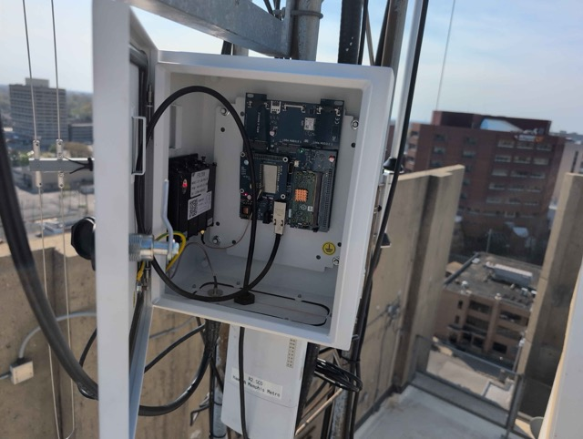
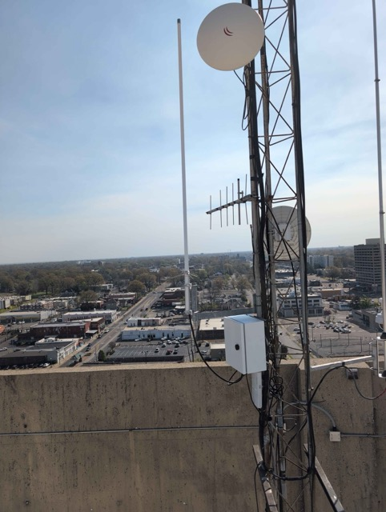

# Nodes

## Medical District v3 MemphisMesh.com (medi)

[View !27ef756b  on meshmap.net](https://meshmap.net/#670004587).

|  |  |
| --- | --- |

This node provides great coverage in the medical district, downtown, and in the neighborhoods nearby. The closer you get to the I-240 loop, the more marginal performance becomes, though rooftop nodes can consistently get connections.

This node is configured for MediumFast preset and the default channel 0 with key `AQ==`.

### Hardware

This node is built using the guts of a NEBRA miner and is centered around a Raspberry Pi. It is powered via PoE and housed in a metal enclosure. The system features a 1W LoRa HAT for increased transmission power and includes a GPS module for location services, along with a SIM card slot for potential cellular connectivity.

A key component is the Airframes cavity filter, tuned to the MediumFast channel plan, which helps reduce interference and improve signal quality. The node is connected to a Diamond 900 MHz antenna, optimized for performance in the 900 MHz band, providing reliable omnidirectional coverage.

### Connectivity

This node is configured to uplink to the official Meshtastic MQTT server on the `msh/US/memphismesh.com` topic.

#### AI-enabled bot

This node also is setup running the [meshing-around](https://github.com/SpudGunMan/meshing-around) bot, which provides basic ping/pong, web search, weather alert, weather forecast, and ask AI capabilities powered by a local Ollama and the [Llama 3.2 3B model](https://ollama.com/library/llama3.2:3b). Try it out by DMing the node "cmd"!
